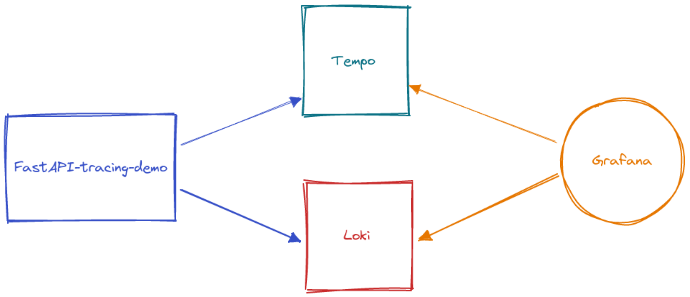
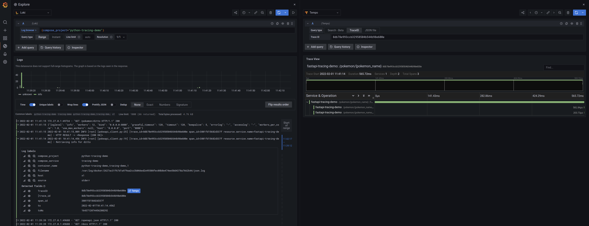

# FastAPI Tracing Demo
Demo to show how to instrument a [FastAPI](https://fastapi.tiangolo.com/) python project 
adding tracing with [OpnTelemetry](https://opentelemetry.io/) and send/show traces in [Grafana Tempo](https://grafana.com/oss/tempo/)



### Requirements
- docker
- docker-compose
- loki docker plugin

You can install the Loki Docker plugin using:  
`docker plugin install grafana/loki-docker-driver:latest --alias loki --grant-all-permissions`

The `main` branch contains the basic app, before instrumenting with OpenTelemetry but with Grafana, Tempo and Loki available.

The `instrumented` branch is the instrumented app, the outcome of going through the demo steps below.

### Run

To bring up the services and test the app, run `make up`
The Grafana dashboard will be available at http://localhost:5000

You can access the application swagger at http://localhost:8080/docs
You can make a call from there to the `pokemon` api or using an http client:

```bash
http http://localhost:8080/pokemon/ditto

HTTP/1.1 200 OK
content-length: 62
content-type: application/json
date: Tue, 01 Feb 2022 10:41:14 GMT
server: uvicorn

{
    "generation": {
        "name": "generation-i"
    },
    "id": 132,
    "name": "ditto"
}
```

Now, open the grafana dashboard in the `explore` panel, select `Loki` as source and query `{compose_project="python-tracing-demo"}` in the `Log Browser` input field.
There you'll find the application logs and, if you click on the log of the call we just made, you can see the **TraceID** with the **Tempo** button that opens the panel with tracing info



## Demo steps
### Install the SDK and API libraries
> ⚠️ This project uses poetry as dependency manager. Change the commands to match yours
```shell
poetry add opentelemetry-api
poetry add opentelemetry-sdk
```

### Install the instrumentation libraries
For this demo we are gonna use FastAPI and Logging instrumentation

```shell
poetry add opentelemetry-instrumentation-fastapi
poetry add opentelemetry-instrumentation-logging
```

### Export traces to tempo
Install the [OTLP exporter](https://github.com/open-telemetry/opentelemetry-python/tree/main/exporter/opentelemetry-exporter-otlp)
that allows us to export tracing data to an OTLP collector or, in our case, directly to Tempo  
This library currently install both the HTTP and gRPC collector exporters. In our example we are going to use the `gRPC` one.
```shell
poetry add opentelemetry-exporter-otlp
```

In our `main.py` let's import the needed packages
```python
from opentelemetry import trace
from opentelemetry.exporter.otlp.proto.grpc.trace_exporter import OTLPSpanExporter
from opentelemetry.sdk.trace import TracerProvider
from opentelemetry.sdk.trace.export import BatchSpanProcessor
from opentelemetry.sdk.resources import Resource

from opentelemetry.instrumentation.fastapi import FastAPIInstrumentor
from opentelemetry.instrumentation.logging import LoggingInstrumentor
```
And now let's set it up to export traces to Grafana Tempo:

```python
resource = Resource(attributes={"service.name": "fastapi-tracing-demo"}) # set the service name to show in traces 

# set the tracer provider
tracer = TracerProvider(resource=resource)
trace.set_tracer_provider(tracer)

# Use the OTLPSpanExporter to send traces to Tempo
tracer.add_span_processor(BatchSpanProcessor(OTLPSpanExporter(endpoint="http://tempo:4317")))

LoggingInstrumentor().instrument()
FastAPIInstrumentor.instrument_app(app, tracer_provider=tracer)
```

To enable trace contect injection into logs, we should set the `OTEL_PYTHON_LOG_CORRELATION` to true.  
So let's add it to our docker-compose file in the `tracing-demo` demo service:

```yaml
tracing-demo:
    build: .
    ports:
      - "8080:8080"
    environment:
      - OTEL_PYTHON_LOG_CORRELATION=true
    logging:
      driver: loki
      options:
        loki-url: http://localhost:3100/loki/api/v1/push
```

To enable `Loki` to recognize `trace_id` in logs, we have to add this config to the `grafana-datasources.yml` in the `loki` datasource section:  
```yaml
jsonData:
      derivedFields:
        - datasourceUid: tempo
          matcherRegex: trace_id=(\w+)
          name: TraceID
          url: "$${__value.raw}"
```

### Resources
- [OTLP exporter](https://opentelemetry-python.readthedocs.io/en/latest/exporter/otlp/otlp.html)
- [Logging instrumentation docs](https://opentelemetry-python-contrib.readthedocs.io/en/latest/instrumentation/logging/logging.html)
- [FastAPI instrumentation docs](https://opentelemetry-python-contrib.readthedocs.io/en/latest/instrumentation/fastapi/fastapi.html)